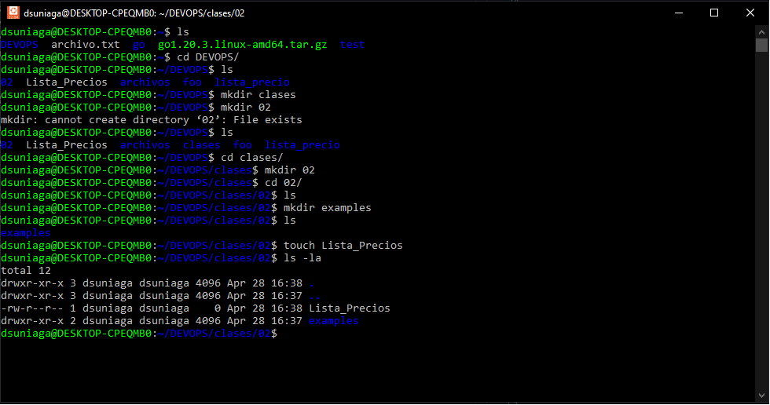
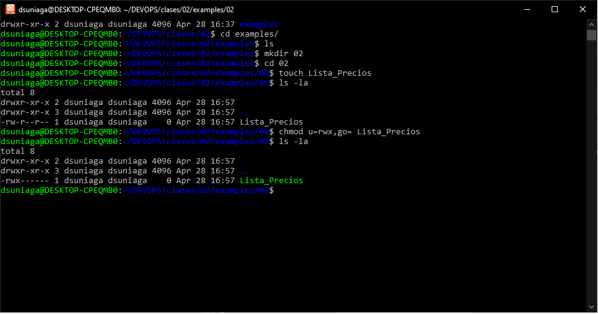

## Detalles del enunciado

Roxs es la líder de un equipo de trabajo para una compañía que realiza Auditorías Externas. Él ha creado un archivo llamado Lista_Precios en su directorio /home. El archivo es altamente confidencial, pero resulta que existe un alto riesgo de que su archivo sea vulnerado porque otros empleados utilizan su equipo al finalizar su turno. Actualmente, Roxs posee una contraseña segura, pero él necesita resguardar los datos de ese archivo y no desea que nadie más que solamente él tenga acceso al mismo. ¿Qué solución le propondrían como equipo a Roxs?

Considere lo siguiente para solucionar el problema.

>Para proveer una solución apropiada para restringir accesos no autorizados al archivo, se necesita realizar lo siguiente:

1.  Identificar las medidas de seguridad a implementarse.
2.  Identificar el tipo de usuarios para quienes los permisos >serán cambiados.
3.  Identificar el tipo de permiso que necesita ser cambiado.
4.  Verificar los permisos de acceso al archivo.

>Entregable, crear un Readme.md con la solución al Problema propuesto

Bien iniciamos la gestión para dar resolución al caso planteado, primeramente creamos los repo y creamos el archivo, en la siguiente imagen podremos ver lo anteriormente mencionado. 

### Identificar las medidas de seguridad a implementarse.

Necesitamos delimitar los permisos a que solo el usuario que creo el archivo pueda gestionarlo. 

### Identificar el tipo de usuarios para quienes los permisos >serán cambiados.

Vamos a cambiar los permisos de los siguientes usuarios: 

* u:usuario
* g:grupo
* o:otros

### Identificar el tipo de permiso que necesita ser cambiado.

Vamos a cambiar los permisos de los siguientes usuarios: 

* r:lectura
* w:escritura
* x:ejecucion

### Verificar los permisos de acceso al archivo.

Haciendo el cambio se puede visualizar que solo el usuario que creo el archivo tiene otorgado los permisos para gestionar el mismo. 

